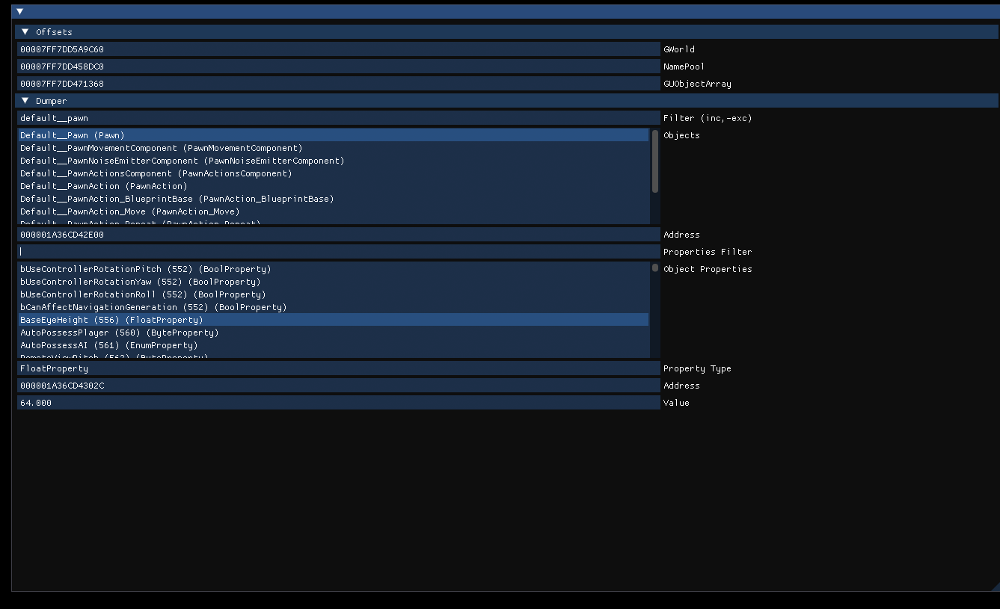

## ReverseUnreal

Okay-grade UE4 reverse utility.

Wrote it as a base library for analysis of some internal projects and learning purposes.
On any non-heavily modified 4.26 (maybe 25 as well?) it should be able to pickup a global list of objects and classes, figure out their name and show properties and their values.

It's currently only works with DX11 but it should be as easy as changing the hooking (can just use kiero for that) and re-implementing imgui.

You can build the library in ./Source and inject it with your favourite injector, alternatively you can also build the one in ./Loader and inject that. 

The idea behind the Loader is that it will keep scanning for changes to the library in ./Source, unload the .dll and reload the new one so you can just keep changing stuff without restarting the application.

